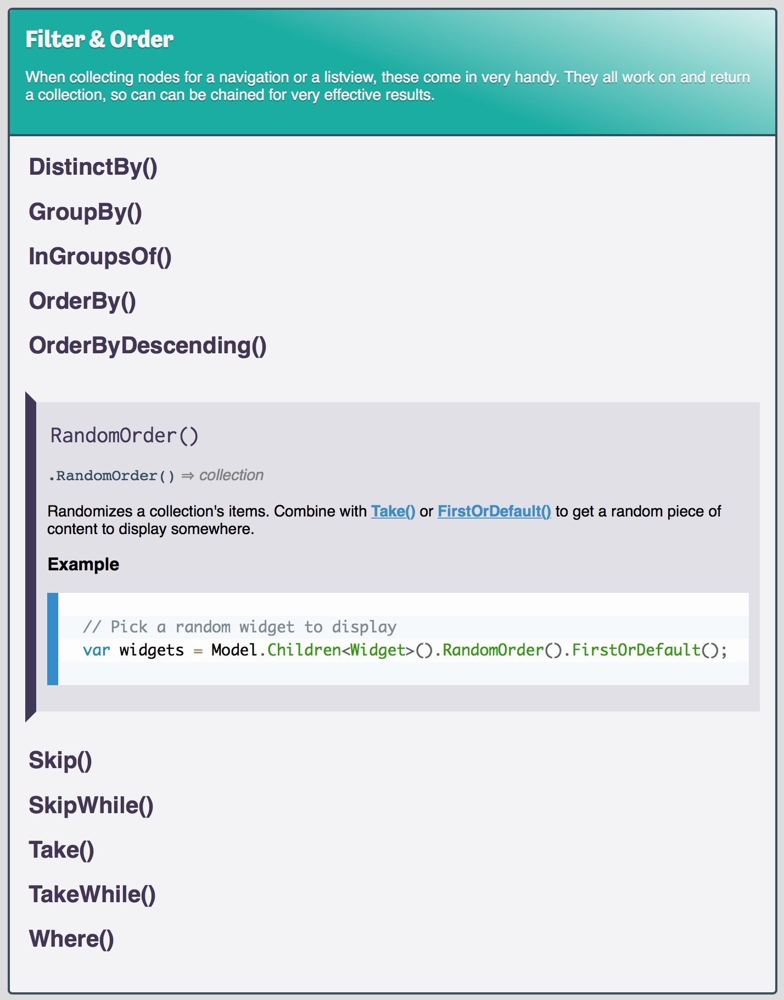

# Umbraco Razor Quick Reference

This is a quick reference/cheatsheet for use when writing Razor views/partials
for [Umbraco][UMB]

There's two main purposes for this:

1. For use with [Dash][DASH] on macOS - it's the perfect app for all sorts of API/reference lookups, as it can use the editor's context for opening the correct bundle (Razor) and search for the "current" word.
2. To serve as a [reference section][UMBRAZREF] on a website so you can easily point people to a URL that explains a specific property/method.

Feel free to use the [issue tracker][ISSUES] or perhaps even fork the repo and submit pull requests for discussion, if you see anything that's missing.

## Credits

* Uses [@LeaVerou][LEA]'s awesome [Prism][PRISM] for syntax-highlighting the code samples

## DEV Notes

I use [CodeKit][CK] for preprocessing the LESS file (enabling autoprefixer), and a bash script to transform the XML file with the list of methods into a single HTML file. Yay, XSLT!

The codesamples are all in a separate XML file, so contributing a small code sample for a property or function should be super easy. (Just imagine if that was a JSON file and you had to escape all the double quotes... *crickets* ... :-)

## TODO

- [x] Write the build script
- [ ] Test the Dash docset
- [ ] Publish somewhere on greystate.dk

*Chriztian Steinmeier, 2018*

[DASH]: https://kapeli.com/dash/
[UMB]: https://umbraco.com/
[UMBRAZREF]: http://greystate.dk/resources/umbraco/razor-reference/
[CK]: https://codekitapp.com/
[ISSUES]: https://github.com/greystate/umb-razor-reference/issues
[LEA]: https://github.com/LeaVerou/
[PRISM]: http://prismjs.com/